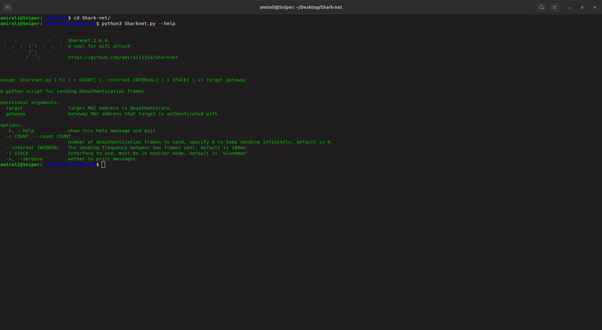
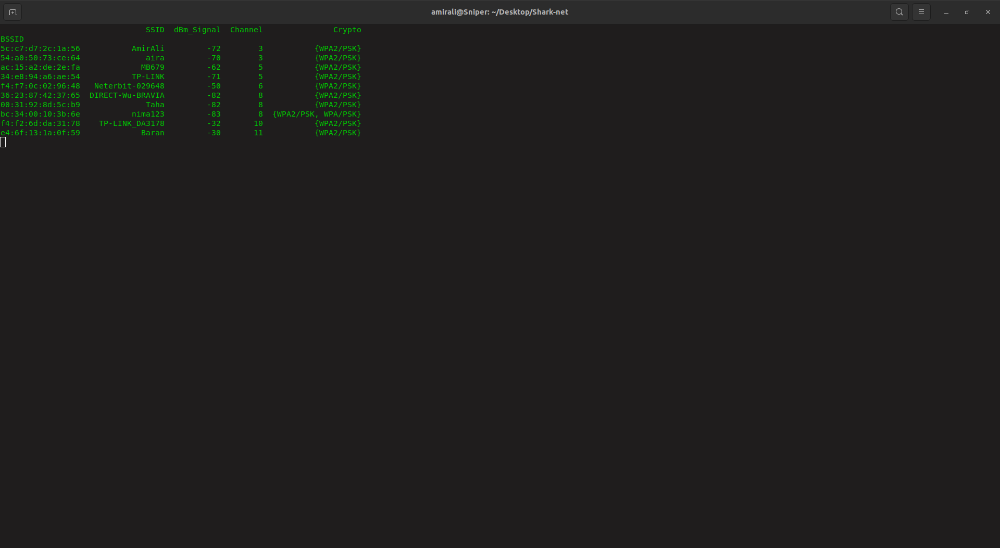
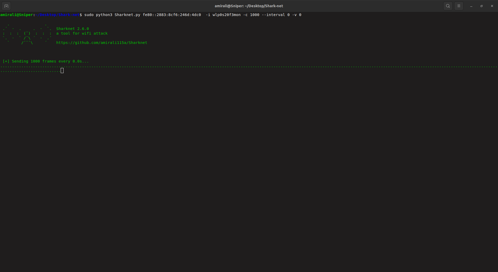

# 🦈 **Sharknet** - WiFi Jammer Tool



A powerful tool for **WiFi network scanning and deauthentication attacks**. Use responsibly! ⚠️

---

## 🔧 **Installation**
```bash
git clone https://github.com/amirali115a/Sharknet
cd Sharknet
bash install.sh
```

---

## 🔍 **Scanning Networks**



Run the following command to **scan for nearby WiFi networks**:
```bash
sudo python3 scan.py -i <interfacemon>
```

---

## 💥 **Launching an Attack**



Use the following command to **send deauthentication packets**:
```bash
sudo python3 AirDeauth.py -b <target bssid> -i <interface> -c <packet count> -t <packet time>
```

### Example Usage:
```bash
sudo python3 AirDeauth.py -b 00:11:22:33:44:55 -i wlan0mon -c 100 -t 0.5
```

---

## ⚠️ **Disclaimer**
**This tool is for educational and research purposes only.** Unauthorized use of WiFi jamming tools is illegal in many countries. Use it only on networks you own or have permission to test.

🚀 **Happy Hacking!**
